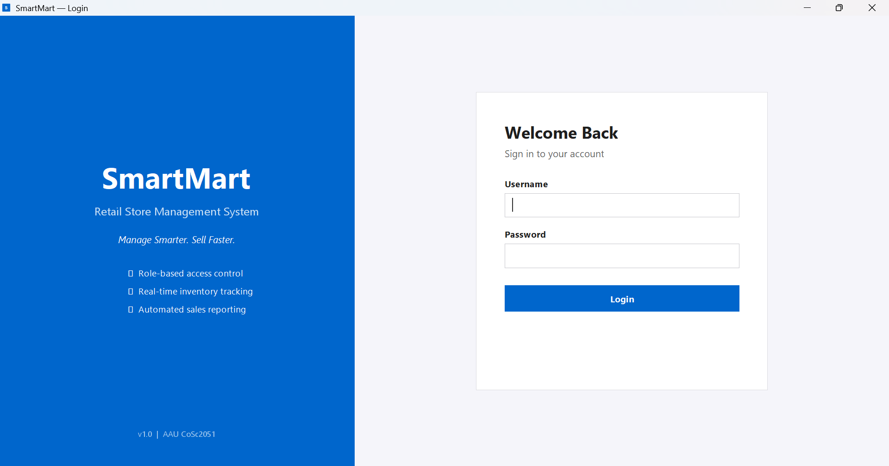
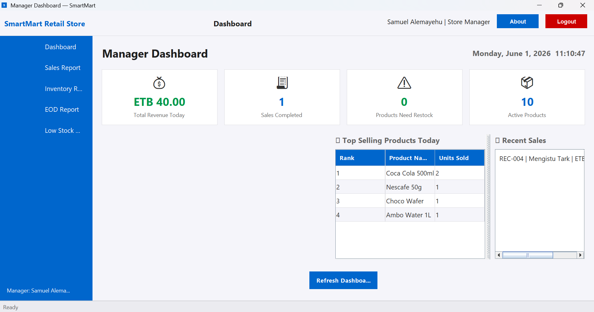

# 🛒 SmartMart — Retail Store Management System


> A fully functional desktop retail store management system built with Java OOP principles, Java Swing GUI, and SQLite backend. Developed as a group project for the Object Oriented Programming course (CoSc2051) at Addis Ababa University, 2025.

---

## 📸 Screenshots

| Login Screen | Admin Dashboard |
|---|---|
|  |  |

| POS / Cashier Screen | Manager Dashboard |
|---|---|
|  |  |

| Product Management | EOD Report |
|---|---|
|  |  |

---

## 🎯 Project Overview

SmartMart is a three-role retail management desktop application that simulates real-world store operations:

- **Admin** manages products, employees, suppliers, categories, restock orders, and system alerts
- **Manager** monitors revenue, generates sales/inventory/EOD reports, and manages low stock alerts  
- **Cashier** processes sales via a Point of Sale screen, manages cart, generates receipts, and views transaction history

---

## ✨ Features

### 🔐 Authentication & Role-Based Access
- Secure login with SHA-256 password hashing
- Three distinct roles: Admin, Manager, Cashier
- Each role unlocks a completely different dashboard and feature set
- UnauthorizedAccessException thrown and caught when access is violated

### 📦 Inventory Management (Admin)
- Full product CRUD with category and supplier linking
- Real-time low stock detection with configurable thresholds
- Color-coded stock status: OK (green), Low Stock (yellow), Out of Stock (red)
- Supplier management with contact information
- Category management

### 🛒 Point of Sale (Cashier)
- Live product search with instant filtering
- Cart management with quantity control
- 15% tax calculation with itemized totals
- Sale completion with formatted receipt generation
- Receipt export to file
- Transaction history with master-detail view
- OutOfStockException and InsufficientStockException handling

### 📊 Reporting & Analytics (Manager)
- Real-time dashboard with revenue, transactions, and alert stats
- Sales report by date range with cashier breakdown
- Inventory report with category analysis and stock valuation
- End of Day (EOD) report with top products and cashier performance
- All reports exportable to .txt files

### 🔄 Restock & Alerts
- Restock order creation linked to suppliers
- Order lifecycle: PENDING → RECEIVED/CANCELLED
- Receiving an order auto-updates product stock
- Automated low stock alert generation and resolution

---

## 🧠 OOP Concepts Demonstrated

| Concept | Implementation |
|---|---|
| **Classes & Objects** | Product, User, Sale, Employee, Supplier, SaleItem, etc. |
| **Encapsulation** | Private fields with getters/setters on all model classes |
| **Inheritance** | User → Admin, Manager, Cashier |
| **Abstract Classes** | abstract User, abstract Report (SalesReport, InventoryReport, EODReport) |
| **Interfaces** | Searchable (matchesQuery), Exportable (toCSVRow, getCSVHeader) |
| **Polymorphism** | currentUser.getDashboardTitle(), report.generate() |
| **Method Overriding** | toString(), equals(), hashCode(), getDashboardTitle() |
| **Method Overloading** | isLowStock(), isLowStock(int customLimit) |
| **super keyword** | All User subclass constructors call super(...) |
| **Enums** | Role (ADMIN, MANAGER, CASHIER), OrderStatus (PENDING, RECEIVED, CANCELLED) |
| **Exception Handling** | 7 custom exceptions, try-catch-finally throughout |
| **GUI (Swing)** | JFrame, JPanel, JTable, JDialog, JTabbedPane, all layout managers |
| **Event Listeners** | ActionListener, MouseListener, KeyListener, ListSelectionListener |
| **Packages** | model, dao, service, ui, exception, util |
| **Access Modifiers** | private, public, protected, package-private used appropriately |

---

## 🗄️ Database Schema
users         → user_id, username, password (SHA-256), role, full_name, is_active
categories    → category_id, category_name
suppliers     → supplier_id, name, contact_phone, email, address
products      → product_id, product_name, category_id*, supplier_id*, price, stock_qty, low_stock_limit
employees     → employee_id, user_id*, full_name, phone, salary, hire_date
sales         → sale_id, cashier_id*, total_amount, sale_date
sale_items    → item_id, sale_id*, product_id*, quantity, unit_price, subtotal
restock_orders → order_id, product_id*, supplier_id*, quantity, status, order_date
alerts        → alert_id, product_id*, message, is_resolved, created_at
(* = foreign key)

---

## 🏗️ Project Structure
SmartMart/
├── src/smartmart/
│   ├── model/          # All entity classes (Product, User, Sale, etc.)
│   ├── dao/            # Database access layer (JDBC + SQLite)
│   ├── service/        # Business logic layer
│   ├── ui/             # Java Swing UI
│   │   ├── admin/      # Admin panel screens
│   │   ├── manager/    # Manager panel screens
│   │   └── cashier/    # Cashier POS screens
│   ├── exception/      # Custom exception classes
│   └── util/           # DB connection, UI helpers, constants
├── database/
│   ├── schema.sql      # Full database schema
│   ├── seed.sql        # Realistic seed data
│   └── init_db.py      # Database initializer script
├── lib/
│   └── sqlite-jdbc-3.45.1.0.jar
├── docs/
│   └── screenshots/    # Application screenshots
├── run.bat             # One-click Windows launcher
└── README.md

---

## 🚀 How to Run

### Prerequisites
- Java JDK 8 or higher
- Python 3 (for database initialization only)

### Option 1: Double-click (Easiest)
Double-click run.bat
The script initializes the database on first run, compiles, and launches automatically.

### Option 2: Manual
```bash
# Step 1: Initialize database (first time only)
python database/init_db.py

# Step 2: Compile
javac -cp "lib/sqlite-jdbc-3.45.1.0.jar" -d out src/smartmart/model/*.java src/smartmart/exception/*.java src/smartmart/util/*.java src/smartmart/dao/*.java src/smartmart/service/*.java src/smartmart/ui/*.java src/smartmart/ui/admin/*.java src/smartmart/ui/manager/*.java src/smartmart/ui/cashier/*.java

# Step 3: Run
java -cp "out;lib/sqlite-jdbc-3.45.1.0.jar" smartmart.ui.MainApp
```

### Default Login Credentials
| Role | Username | Password |
|---|---|---|
| Admin | admin | admin123 |
| Manager | manager | manager123 |
| Cashier | cashier1 | cashier123 |

---

## 👥 Team Members

| # | Name | Role |
|---|---|---|
| 1 | Melkamu Abyot | Lead Developer |
| 2 | Samuel Alemayehu | Backend Developer |
| 3 | Mengistu Tark | UI Developer |

---

## 📚 Course Information
- **Course:** Object Oriented Programming (CoSc2051)
- **Institution:** Addis Ababa University
- **Year:** 2025
- **Instructor:** CoSc2051 Course Instructor
---
